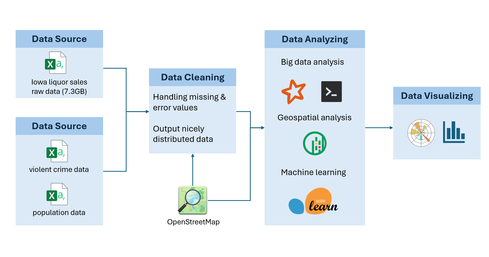

# CMPT 732 Big Data Project Report

* Theme: Analysis of Liquor Sales Data in Iowa
* YouTube video link: https://www.youtube.com/watch?v=eNGkROW1Uew&ab_channel=SophiaYang
* Github Link: https://github.sfu.ca/wya65/cheerstodata

## Problem definition

Conducting commodity trading is a vital economic activity. The liquor sales data from Iowa provides numerous valuable attributes and is relatively complete, making it an ideal foundation for designing our analysis.

**Our objectives are:**
* Focusing on consumer perspectives. Identify the most popular brands and types of liquor, drinking preferences in different regions and the impact of different characteristics on sales. Explore trends in liquor prices over time, investigate the pricing strategies behind these trends
* From seller's perspective, analyze how geographic location or population size influences liquor sales.
* From the social perspective, explore whether liquor sales performance is linked to local crime behavior.

**The dataset we used in our study are:**
* The primary dataset: [Iowa liquor sales data](https://data.iowa.gov/Sales-Distribution/Iowa-Liquor-Sales/m3tr-qhgy/about_data)
* Additional dataset 1: [OpenStreetMap](https://www.openstreetmap.org/#map=19/41.740010/-93.603568)
* Additional dataset 2: [Iowa County population data](https://www.census.gov/data/datasets/time-series/demo/popest/2020s-counties-total.html)
* Additional dataset 3: [Iowa Crime Data](https://icrime.dps.state.ia.us/CrimeInIowa/Home/Index)

**To achieve the objectives we defined, we have divided our study into four aspects:**
* [General Analysis on Sales](Sales%20Basic%20Info#analysis-of-iowa-state-liquor-sales-data-extremes-distribution-and-correlation)
* [Sales Trends Analysis](Sales_Trends_Analysis/SalesTrends_Analysis_README.md#salestrends_analysis)
* [Regional Analysis](Regional%20Analysis#readme)
* [Crime and Liquor Consumption Analysis](alcohol_and_vandalism_prediction#readme)

## 2. Methodology

.  

As shown in the figure above, our project starts with collecting data, then we have a preliminary understanding of the data, determine the direction of the problem to be studied, and then use the spark framework to clean and adjust it appropriately to adapt to the subsequent query and analysis work. After that, we use the cleaned data to conduct relevant analysis of interest. In this process, we still mainly use the spark framework, and also use some other APIs, and apply some machine learning methods to analyze the relationship between different data. Finally, we choose a suitable visualization solution to make the results clearer and easier to read.

### Data Processing and Cleaning

The objective of this data cleaning task is to preprocess the Iowa Liquor Sales dataset to ensure data integrity, consistency, and accuracy, providing a reliable foundation for subsequent data analysis and modeling. The original data was exported from the official website, and the cleaned data has been saved to a designated local directory for further processing.

The tasks we have implemented include:
* Overview of the Original Data
* Basic Data Cleaning Process
* Data Completion Process
* Add Locations from OpenStreetMap (OSM)

[See More Details](Data_Processing_Cleaning/DataCleaning_README.md#data_processing_cleaning) 

### General Analysis on Sales

In this part: Analysis of the Iowa State Liquor sales dataset explored several dimensions:

- **Popularity Analysis**: Examined stores, products, cities, and sales volumes using basic statistical methods like sorting, grouping, and aggregation.

- **Pricing and Volume Distribution**: Tested if liquor costs and retail prices follow a normal distribution, identified common price ranges, and analyzed bottle sizes (ml) and Pack sizes for consumer preferences.

- **Temporal and Regional Trends**: Investigated sales trends for specific liquors (ranks 1-3 and 8-10) and Pack sizes (6, 12, 48) across selected years (2013, 2017, 2021) and months. Also analyzed the top ten liquors' sales distribution in six leading cities.

- **Sales Correlation and Feature Importance**: Studied correlations between sales and factors like unit price, volume, and Pack size. Used Random Forest for feature importance analysis, finding it more effective than Lasso.

> Tools: Spark's DataFrame API handled the large dataset efficiently, with matplotlib for visualization and pandas for data processing. MLlib facilitated advanced analytics.

[See More Details](Sales%20Basic%20Info/Readme.md#Methodology)

### Sales Trends Analysis

In this part: Explore sales trends in Iowa Liquor Sales data and forecast future sales:

**Exploratory Analysis**: Analyze sales patterns from 2018 to 2024, including monthly, quarterly, and holiday-specific trends, to identify seasonal and annual variations. We implemented the following tasks:
  - Monthly Sales Trend Analysis
  - Quarterly Sales Trend Analysis
  - Holiday Sales Analysis

**Sales Forecasting**: Use machine learning techniques to predict future sales, with a particular focus on December 2024 sales performance. Including the following tasks:
  - Feature Engineering
  - Model Selection
  - Model Evaluation
  - Forecasting Process

> Tools:PySpark efficiently handles large-scale data processing with distributed computing and a SQL-style API for feature extraction and filtering. Pandas offers flexibility for data manipulation, pivot tables, and feature preparation. Matplotlib provides customizable tools for visualizing sales trends, while Scikit-learn delivers robust machine learning models and metrics for regression analysis.

[See More Details](Sales_Trends_Analysis/SalesTrends_Analysis_README.md#salestrends_analysis)

### Regional Analysis
We studied two topics regarding regional information. One is more general on the sales analysis at County level. The other is more local focusing on the local geospatial factors that could influence sales.  
#### Topic 1: Regional Analysis on County Level
Iowa State has 99 Counties. We wonder how liquor sales and consumption differ across Counties. There are a few questions we can ask that might be interesting.
* Q1. What are the top five Counties with the most liquor stores?
* Q2. Which County spend the most money on liquors each year?
* Q3. People from which County drink the most? How much do they drink on average?
* Q4. Which County has the best performing liquor stores on average?  

To perform regional analysis, we implemented the following tasks:
* Summarize Liquor Sales and Consumption Data by County
* Combine with US Census Population Data
* Plot Findings on Iowa State Map

[See More Details](Regional%20Analysis/Topic1.md#methodology)

#### Topic 2: What Geospatial Factors Might Influence Liquor Sales
Some liquor stores have higher sales, some lower. We wonder, could there be any spatial factors affecting the store performance? For example, if a store is surrounded by bars or restaurants, maybe they will purchase beverages from the liquor store quite often. Or, if there is a stadium nearby, people might buy more drinks when there are sports events. In order to study these geospatial factors, we again retrieve data from OpenStreetMap, and explore the correlation between these factors and store sales performances. From the County-level analysis, we have already known that Polk County has the most number of liquor stores, and also best performing stores on average. So Polk County could be a good example for us to explore.

To perform geospatial analysis, we implemented the following tasks:
* Search Places of Interests (POI) by OpenStreetMap
* Count Number of POIs Within 2km for each Liquor Store
* Summarize Transactions, Sales, and Consumption Data by Store
* Analyze Correlation between Store Performance and Nearby POIs

[See More Details](Regional%20Analysis/Topic2.md#methodology).  

### Crime and Liquor Consumption Analysis

The objective was to predict vandalism rates across counties by alcohol consumption, since it is widely believed that alcohol is one of the most important causes of some misbehaviors.
We are using two methods:

* Standard Linear Regression: Utilized total alcohol sales data (order count and total gallons sold) as features.
* Exponentially Weighted Moving Average (EWMA): Emphasized recent trends in alcohol sales using a weighted average.

The analysis process includes the following steps:
* Data Splitting:
* Feature Engineering: For the standard method: Total orders and total gallons sold were directly used as features. For the EWMA method: Features were calculated using a span of 3 for EWMA to emphasize recent sales data trends.
* Evaluation: Both models were trained using the training set. The test set was used to evaluate performance using the mean squared error (MSE) as the loss function. Weights (w1,w2) and intercept (b) were extracted for interpretability.

[See More Details](alcohol_and_vandalism_prediction/README.md#methodology)

## Problems

### Problems in Bacic Data Processing and Spark running

- Normalize data for fair comparision. This one is just a small tips when we tried to compare sales among different stores. We noticed that it is not fair to compare the total sales or total transactions, since some shop has opened for several years but other stores might just opened for a few months. The method we use is to find the earlist and latest record a store has, divide the difference by 365 days and round to a whole year. Now the normalization is store-wise, depending on the number of years it has opened.  
- Memory management: Memory was often insufficient during Spark operations. To solve this, I tried various methods, including configuring appropriate memory parameters, increasing JVM heap memory, optimizing data processing flow, and reducing data volume.
- Version issues: Incompatibility between Spark and pyspark versions led to some functions being unusable, later switched to Pandas for data processing.
- Spark sessions not properly closed, leading to resource release issues, later wrote finally blocks to ensure resource release.
- DataFrame type confusion: During data processing, I often needed to convert DataFrames to other types, such as Pandas DataFrame or RDD, but sometimes overlooked this, leading to type confusion. Later resolved through documentation review and testing.
- Holiday Matching Complexity: Used a UDF to dynamically generate date ranges for variable-date holidays like Thanksgiving, ensuring accurate mapping to sales data.
- Runtime Environment Errors: Running Spark and Scikit-learn together caused script errors due to Python environment version mismatches or dependency conflicts.To solve this, a virtual environment was reconfigured to ensure compatibility between Spark and machine learning libraries, and dependency issues were resolved by tracking errors through detailed logs.

### Problems in Geographic data Processing

* **Integrate big data analysis with non-big data tools**.  
We want to do some geospatial analysis, such as interacting with OSM, spatial join two locations, plot maps, etc. Unfortunately, many popular geospatial analysis tools are not big data tools (for example, Geopy, GeoPandas, Osmnx, etc.). Our strategy is to use Spark to “shrink” the data into a minimum number of rows before we feed it to Pandas, do whatever geospatial operation with this smaller table, save the result and convert back to Spark, and use Spark to join back this result with the original big data for whatever further analysis.  
[See More Details](Regional%20Analysis/Problems.md#integrate-big-data-analysis-with-non-big-data-tools)

* **Messy data from OpenStreetMap**.  
OpenStreetMap is good in its rich contents and API services, and it is totally free. However, because anyone can annotate, the data on OSM is sometimes messy. Here are some situations we encountered and how we dealt with:

  * When searching locations based on store name or store address.
  * Looking for tags that are relevant but cannot find any result.
  * Repetitive annotation of the same building.

  [See More Details](Regional%20Analysis/Problems.md#messy-data-from-openstreetmap)

### Problems in Visualization

- When creating histograms, data needed scaling due to large absolute value differences to prevent chart disproportion.
- Sometimes charts were cluttered with poor readability: To improve aesthetics, better color schemes were adopted for clarity, and the number of displayed digits was controlled by removing less important numbers.
- Pivot Table Errors: Resolved missing value issues by filling them with 0 using fillna(0) before pivot table generation, preventing errors.
- Uneven Data Distribution: Addressed seasonal sales imbalances by engineering features like Quarter to capture patterns and ensuring balanced training and testing datasets

### Problems in Machine Learning Methods Application

- Feature importance analysis method selection: Initially chose Lasso method but found it less effective, ultimately used Random Forest algorithm.
- Correlation analysis and feature selection: Initially selected all features but found computation too intensive, so selected only important features. The process of selecting important features had some detours, initially unclear which features were important, took several iterations to finalize analysis variables.

## Results

### General Analysis Results on Sales

In the popularity analysis, based on sales volume, we analyzed the top ten most popular Vendors, Stores, Items, and cities when buying wine. It can be found that generally speaking, the first and second place will have a large gap with the third place, and the gap between the 5th to 10th place will be significantly smaller.
In the distribution analysis, we know that the price of everyone’s favorite wine is concentrated around $11, the capacity of the best-selling wine is 767.9ml, and the Pack is 12.
In a more detailed analysis, it can be seen that different cities have different preferences for wine, and the best-selling wines will also change in different years.
In the correlation and feature analysis, we can see the impact of wine packaging and selling price on sales volume and sales. In different years, these effects also change, reflecting changes in people's psychology of buying wine.

 [See More Details and Graphs](Sales%20Basic%20Info/Readme.md#Results)

### Sales Trends Analysis Results

- Sales exhibit seasonal fluctuations, with peaks at the end of the year and relatively stable performance during other months.
- The fourth quarter contributes the highest portion to annual sales, likely due to increased holiday-related consumption. The trends across quarters remain consistent between years.
- Thanksgiving and Christmas play a pivotal role in yearly sales performance, suggesting businesses could benefit from intensified promotional efforts in the lead-up to these holidays.
- The Random Forest model can provide reasonable predictive value for December 2024 sales.

[See More Details and Graphs](Sales_Trends_Analysis/SalesTrends_Analysis_README.md#result-analysis)

### Regional Analysis Results

**Regional Analysis on County Level**.  
The County that have the most number of liquor store is Polk County.  
The County that loves drinking the most is Dikinson.  
The County that has the best performing store is again Polk County.  

[See More Details and Graphs](Regional%20Analysis/Topic1.md#result)

**What Geospatial Factors Might Influence Liquor Sales**.  
The number of restaurants nearby has a positive influence on liquor store performance. On average, a store surrounded by more than 10 liquor stores has higher annual sales and transactions amount than a store with no restaurant at all. The number of bars surrounding liquor stores also affect the yearly transactions, sales, and volumes sold in a positive way. There is no pattern of how local stadiums influence liquor store sales.

[See More Details and Graphs](Regional%20Analysis/Topic2.md#result)

### Crime and Liquor Consumption Analysis Results

The standard linear regression method provided better predictions with lower loss. The EWMA method emphasized recent data but failed to outperform the standard approach. This indicates that historical data trends may be more influential in predicting vandalism rates.

[See More Details and Graphs](alcohol_and_vandalism_prediction/README.md#observations)

## Project Summary

* Getting the data: Acquiring/gathering/downloading.(1) 
  * [See dataset](README.md#problem-definition)
* ETL: Extract-Transform-Load work and cleaning the data set. (3)
  * We [cleaned data](Data_Processing_Cleaning/DataCleaning_README.md#data_processing_cleaning) with missing/error values, and did extra work on [filling missing location data](Data_Processing_Cleaning/DataCleaning_README.md#add-locations-from-openstreetmap-osm).   
* Problem: Work on defining problem itself and motivation for the analysis.(3) 
  * [Project objectives](README.md#problem-definition)
* Algorithmic work: Work on the algorithms needed to work with the data, including integrating data mining and machine learning techniques.(4)
  *  Machine learning in [sales prediction](Sales_Trends_Analysis/SalesTrends_Analysis_README.md#methods-and-tools), [feature correlation analysis](Sales%20Basic%20Info#correlation-and-feature-importance-analysis), [crime prediction](alcohol_and_vandalism_prediction/README.md#methodology)
  *  Worked with [geospatial data](Regional%20Analysis/Topic2.md#search-places-of-interests-poi-by-openstreetmap) and integrated big data analysis with non big data tools.
* Bigness/parallelization: Efficiency of the analysis on a cluster, and scalability to larger data sets.(1) 
  *  Although we didn't use cluster for storage and computation, our implementation can be scaled to larger datasets.
* UI: User interface to the results, possibly including web or data exploration frontends. (0)  
* Visualization: Visualization of analysis results. (4). 
  * We used Matplotlib to plot plenty of anlaysis results including [barcharts, line graph, piechart, heatmap, etc](Sales%20Basic%20Info#results).
  * We also plot our [regional analysis](Regional%20Analysis/Topic1.md#result) geographically using GeoPandas.
* Technologies: New technologies learned as part of doing the project. (4). 
  * A few technologies we learned and used while completing this project are Python Spark, Scikit-learn, Matplotlib, GeoPandas, Geopy, Osmnx

**Total: 20.**

Project Contributors: Sophia Yang (xya134, 301627219), Yingzi Yuan (yya,301621972), Weiwei Zhang (wza124,301622769), Wenqian Yue(wya65, 301625841) 

