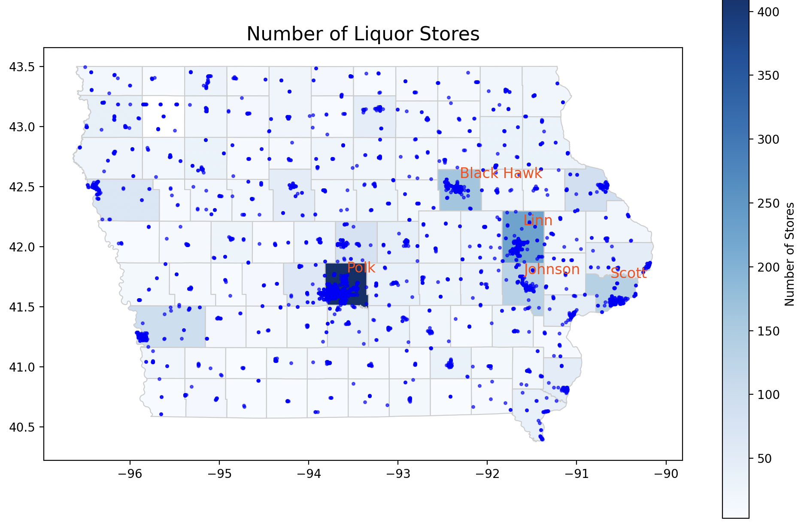
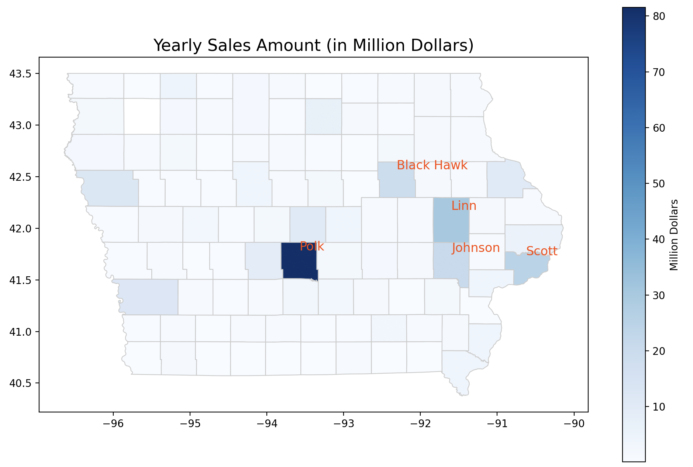
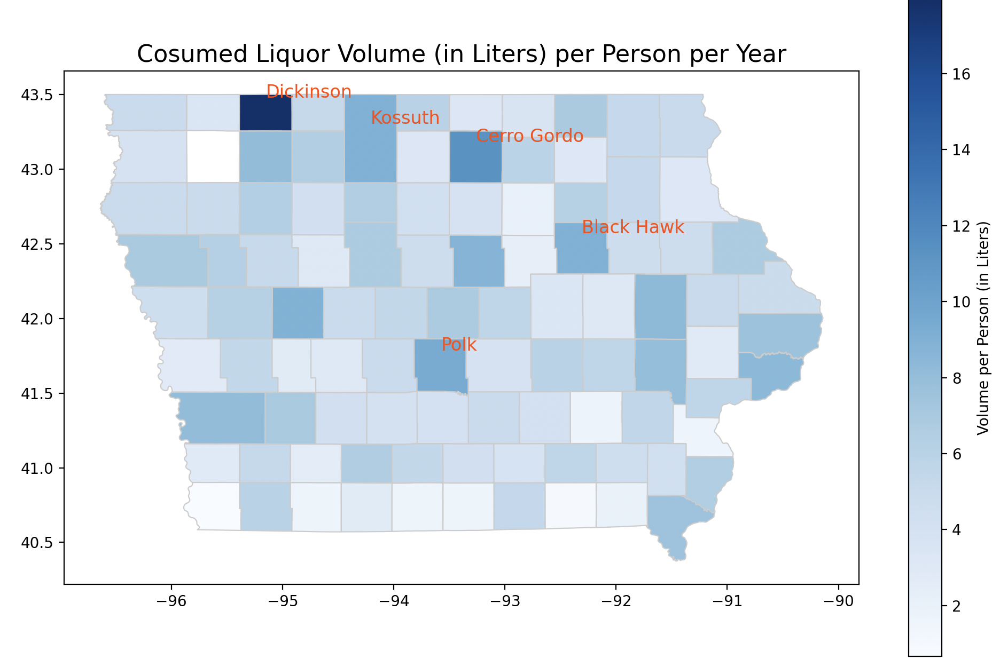
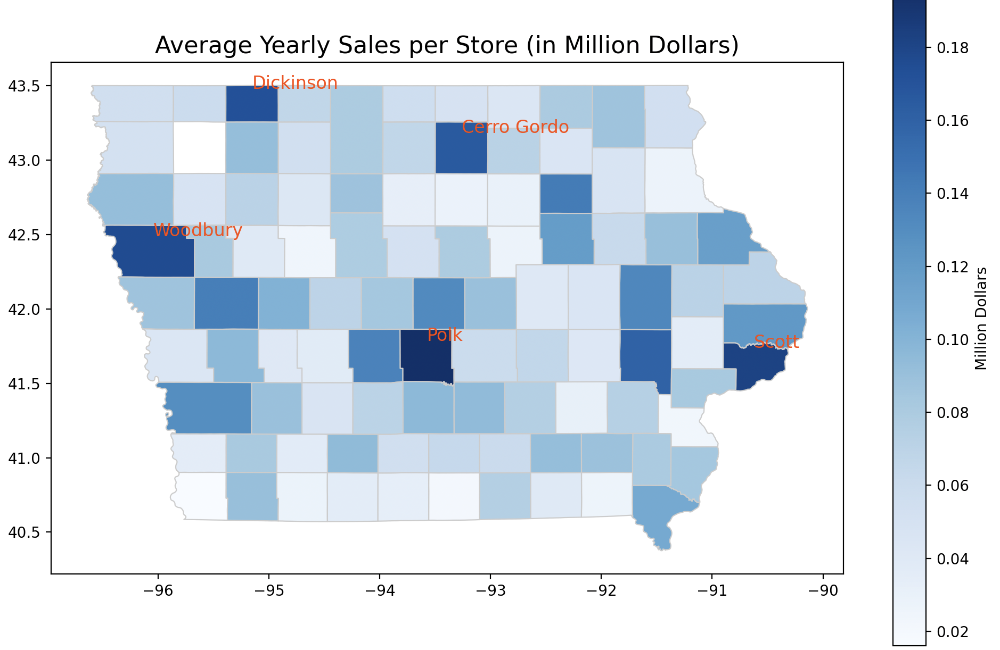

# Regional Analysis on County Level
Iowa State has 99 Counties. We wonder how liquor sales and consumption differ across Counties. There are a few questions we can ask that might be interesting.
* Q1. What are the top five Counties with the most liquor stores?
* Q2. Which County spend the most money on liquors each year?
* Q3. People from which County drink the most? How much do they drink on average?
* Q4. Which County has the best performing liquor stores on average?

## Methodology
### Summarize Liquor Sales and Consumption Data by County
We used a 10 year span to do our analysis, from 2014 to 2023. We aggregated the sum of sales, liquor consumption and number of stores grouped by County. We also normalized the sales and consumption yearly for the data to make more sense.
### Combine with US Census Population Data
We also wanted to take into consideration the population in each County. We found this data from the [US Census Bureau](https://www.census.gov/data/datasets/time-series/demo/popest/2020s-counties-total.html), containing the name of the county and the population collected in 2020 by government officials. The data size is small, but contains some marks (such as ,) and words (such as “County, Iowa”) that we did not want. Thus a little data cleaning with regular expressions was required when reading the data.
### Plot Findings on Iowa State Map
We downloaded the [Iowa County shapefile](https://hub.arcgis.com/datasets/8a1c2d500d8847d79aa47d45d44eb133_0/explore) so that we can plot our heat map on top of the Iowa County map. The additional library we used is [GeoPandas](https://geopandas.org/en/stable/getting_started.html), which is a Python library that simplifies working with geospatial data by extending Pandas to support spatial operations and geometry types (e.g., points, lines, polygons). We did analysis with Spark and converted the resulting table to Pandas Dataframe, so that it could be merged with the Iowa County Map and plot with [GeoDataFrame.plot()](https://geopandas.org/en/stable/docs/reference/api/geopandas.GeoDataFrame.plot.html).

## Result
### Q1. Which County Has More Liquor Stores?
Polk County has the most liquor stores, with nearly 400 stores.  
.  
### Q2. Which County Spend the Most on Liquor?
We can imagine, with 400 liquor stores, Polk County will have the highest annual sales on liquor in Iowa. The result proves that. Polk County spends way more than other Counties.  
.  
### Q3. Which County Loves Drinking the Most?
People in Dickinson love drinking the most. People on average drink more than 16 Liters of alcohol each year.  
.  
### Q4. Which County Has Best Performing Stores?
Many Counties sales data look fine. The stores in Polk County, Scott, Woodbury, Cerro Gordo and Dickinson (no doubt!)  have the best annual sales on average.  

