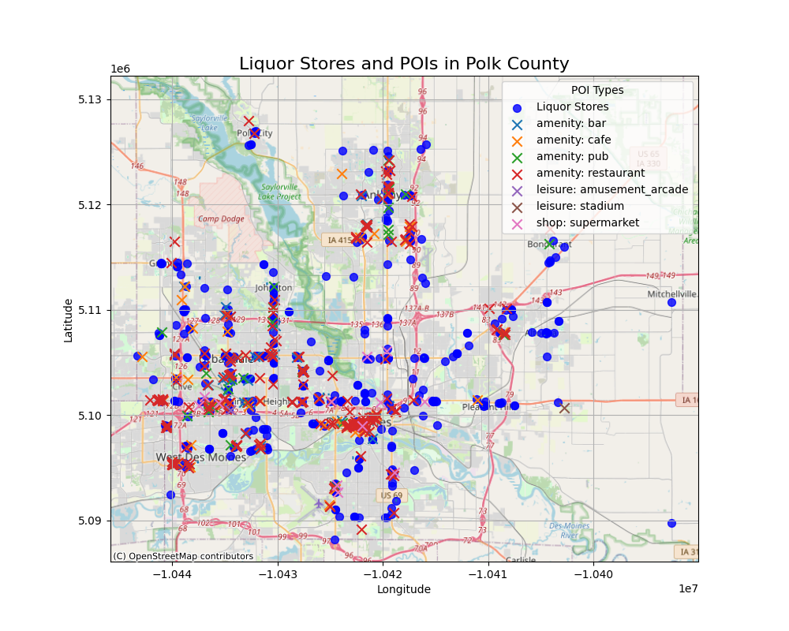
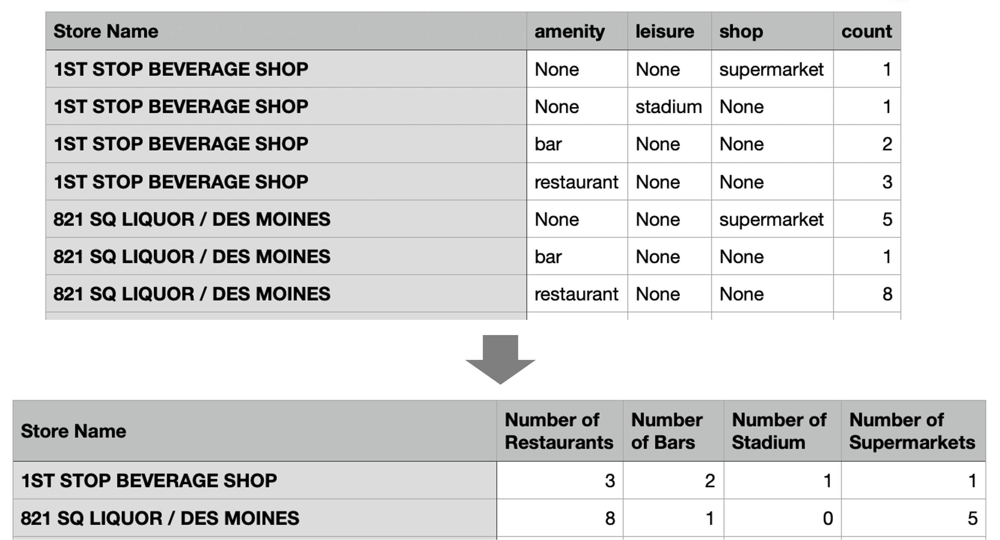
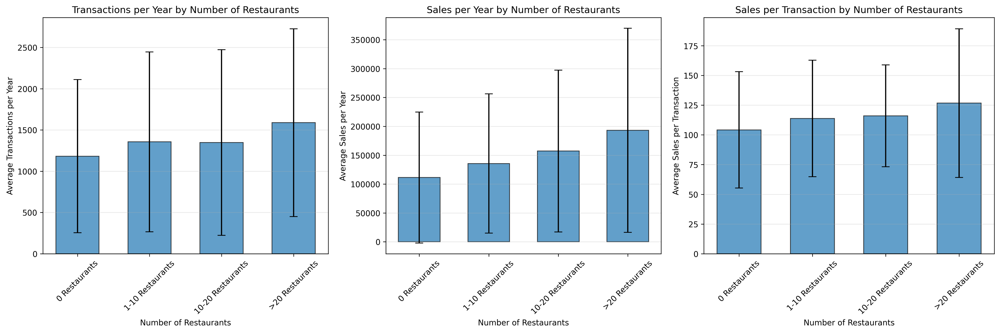
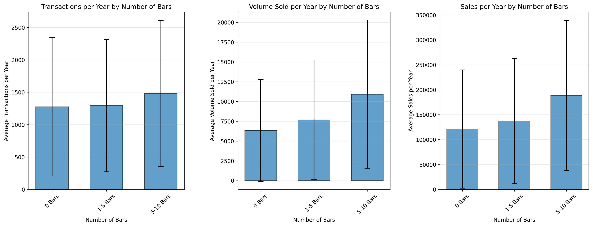
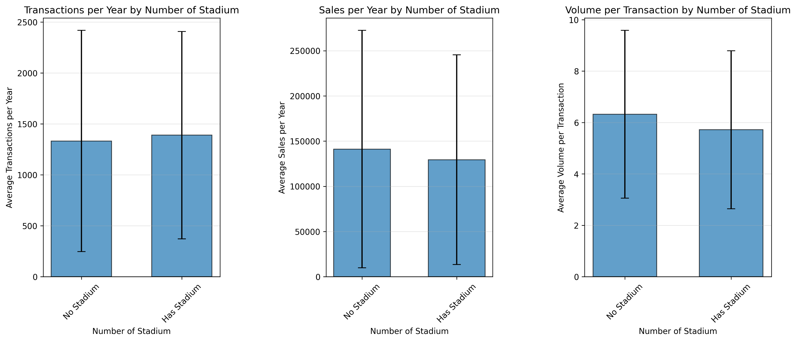
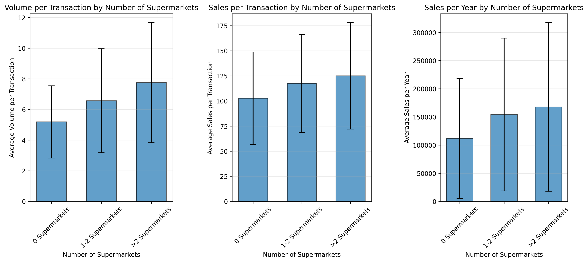

# What Geospatial Factors Might Influence Liquor Sales
Some liquor stores have higher sales, some lower. We wonder, could there be any spatial factors affecting the store performance? For example, if a store is surrounded by bars or restaurants, maybe they will purchase beverages from the liquor store quite often. Or, if there is a stadium nearby, people might buy more drinks when there are sports events. In order to study these geospatial factors, we again retrieve data from OpenStreetMap, and explore the correlation between these factors and store sales performances. From the County-level analysis, we have already known that Polk County has the most number of liquor stores, and also best performing stores on average. So Polk County could be a good example for us to explore.

## Methodology
### Search Places of Interests (POI) by OpenStreetMap
We used another python library [osmnx](https://osmnx.readthedocs.io/en/stable/getting-started.html) to deal with OpenStreetMap data. The library provides tools for retrieving, analyzing, visualizing, and interacting with spatial data, particularly related to streets, networks, and Points of Interest (POIs). We can use the [.features_from_place()](https://osmnx.readthedocs.io/en/stable/user-reference.html#osmnx.features.features_from_place) method to search for elements with certain [tags](https://wiki.openstreetmap.org/wiki/Tags) within a geographic boundary. The OSM tags we chose are “amenity: bar, cafe, pub, restaurant”, “leisure: stadium”, “shop: supermarket”. The figure below shows the places of interest and the liquor stores location on the map of Polk County. Altogether there are 395 liquor stores and 686 places of interest.

### Count Number of POIs Within 2km for each Liquor Store
The next thing we did was spatially joining the liquor store location and the POI location to find how many of the POIs lie within a 2km radius for each store. This can be achieved by the python library [Geopandas](https://geopandas.org/en/stable/getting_started/introduction.html). The basic data type in Geopandas is [GeoDataFrame](https://geopandas.org/en/stable/docs/user_guide/data_structures.html#geodataframe), which stores geospatial data such as Point, Polygon, etc. and can perform geospatial operations. We can filter the store and location data by Spark and convert to GeoDataFrame. We then add a buffer of 2km to our store GeoDataFrame, and use [.sjoin()](https://geopandas.org/en/stable/docs/reference/api/geopandas.GeoDataFrame.sjoin.html#geopandas.GeoDataFrame.sjoin) to spatially join with the POI GeoDataframe. Then we grouped the result based on POI tags type and counted the number of joined data for each group. The result table is shown below, where each row represents one store and one tag, as well as the number of that tagged POI within 2km distance. Finally we use Spark again to transform this table into a more compacted Spark DataFrame that can later be joined with sales DataFrame for further analysis.

### Summarize Transactions, Sales, and Consumption Data by Store
We filtered the data in Polk County and calculated the sum of sales, liquor consumption, and counted the number of transactions. We also calculated the earliest and latest dates of record for each store and calculated how many years this store has been opening. We normalized the sum of sales, liquor consumption, and number of transactions by dividing the number of years for fair comparison.

### Analyze Correlation between Store Performance and Nearby POIs
Lastly we use bar plot to see whether the average of sales has significant difference when the number of local POIs vary. For example, would the yearly sales amount differ on average, for stores with 0 restaurants nearby and stores with more than 10 restaurants nearby? The detailed analysis will be stated in the result part.

## Result
### Influence by Local Restaurants  
From the barchart we can see that the number of restaurants nearby has a positive influence on liquor store performance. On average, a store surrounded by more than 10 liquor stores has higher annual sales and transactions amount than a store with no restaurant at all. However, the error bar is also large for each catagory, meaning that the liquor store sales with the same neighbourhood condition varies a lot.

.  
### Influence by Local Bars  
The number of bars surrounding liquor stores also affect the yearly transactions, sales, and volumes sold in a positive way.

.   
### Influence by Local Stadiums  
There is no pattern of how local stadiums influence liquor store sales.

.  
### Influence by Local Supermarkets  

.  
