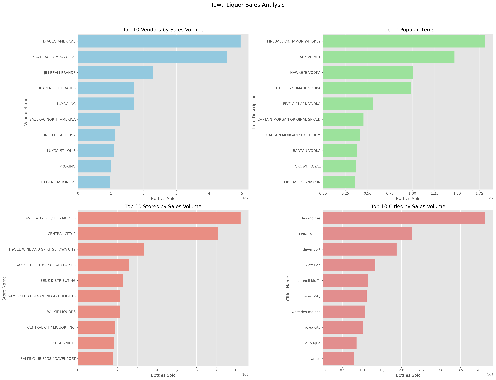
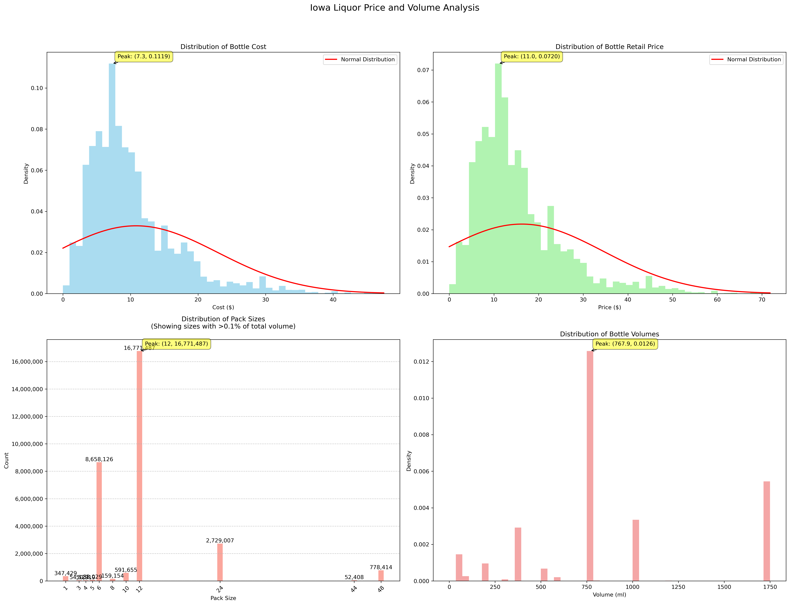
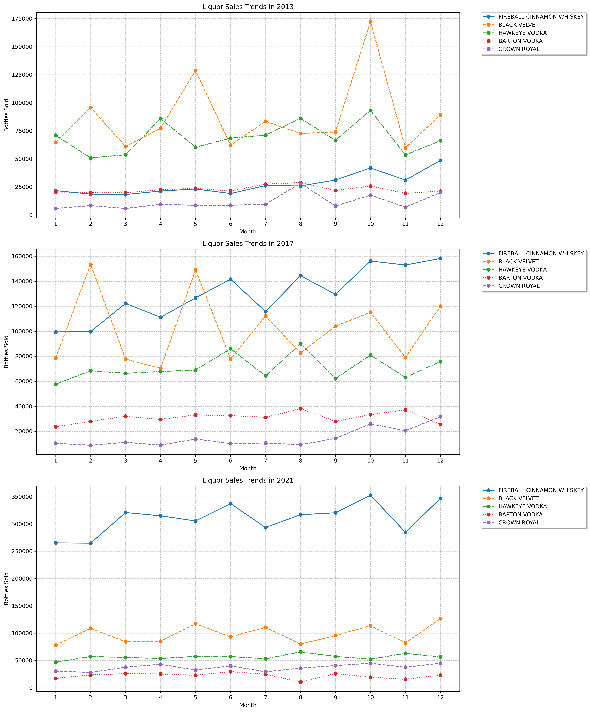
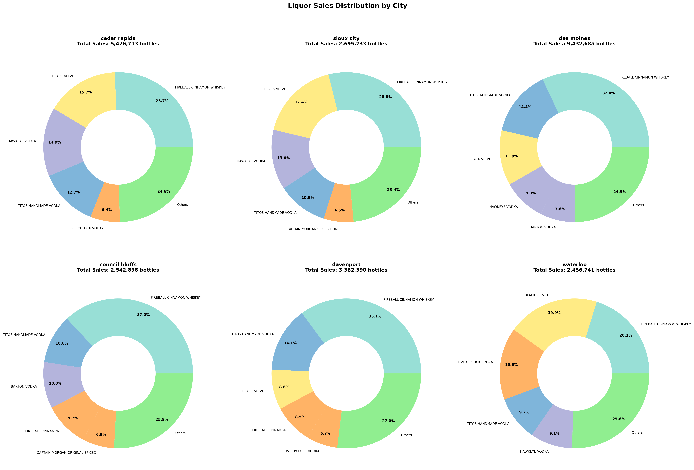
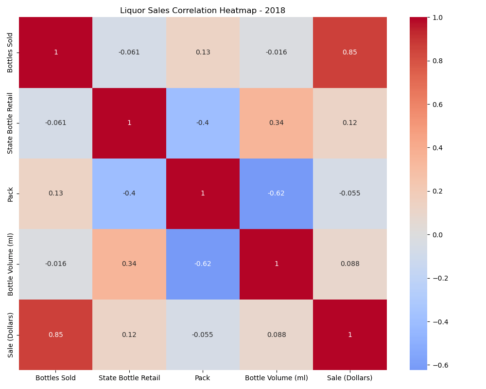
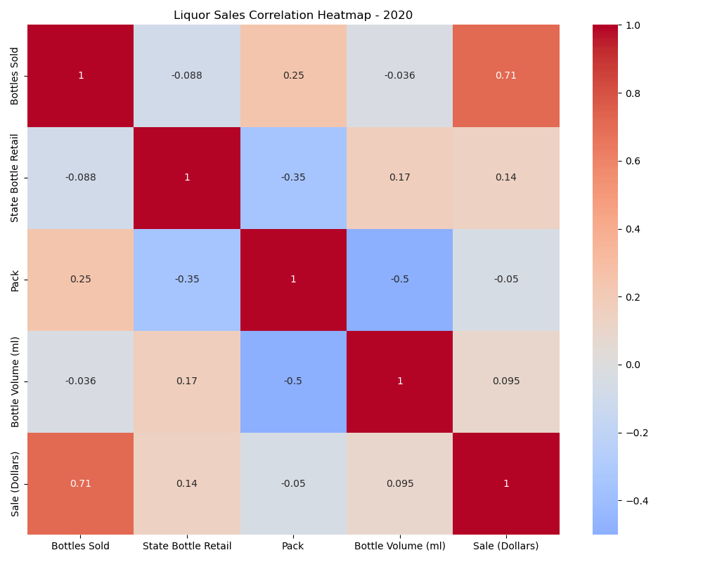
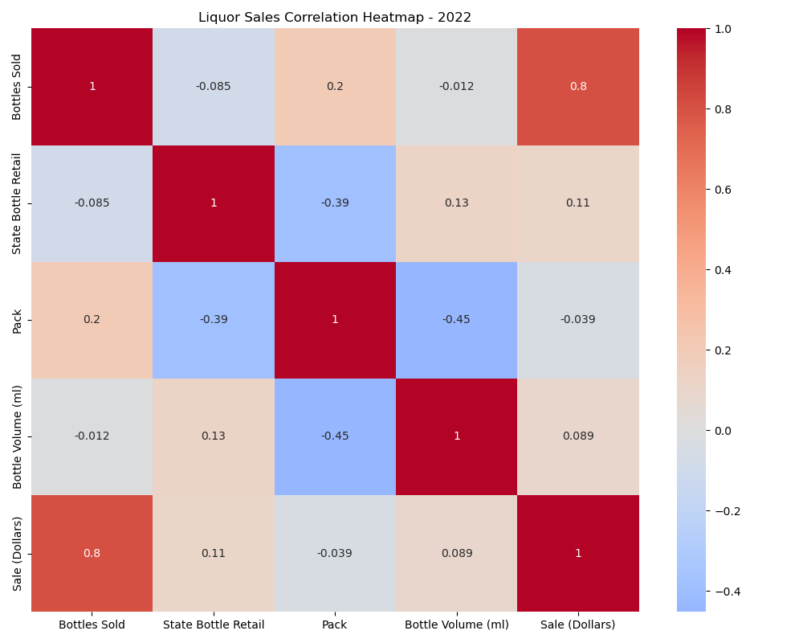
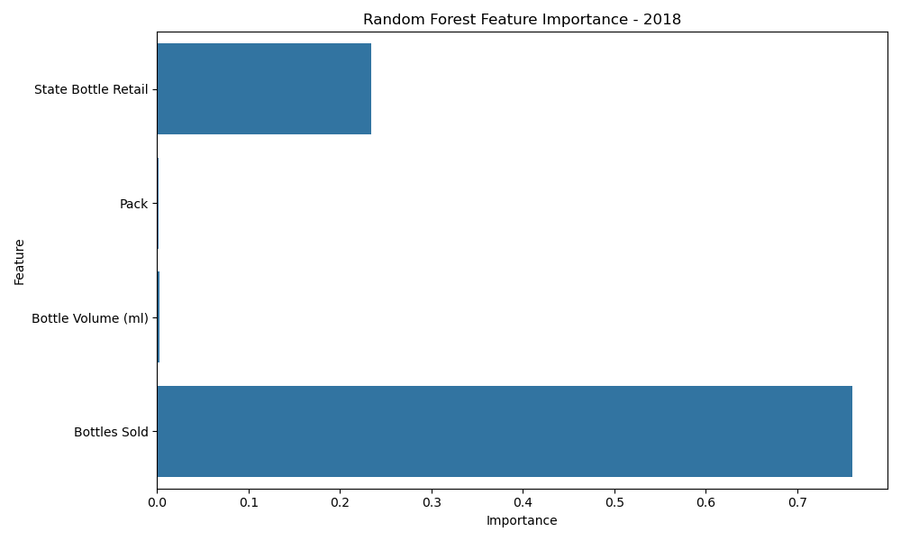
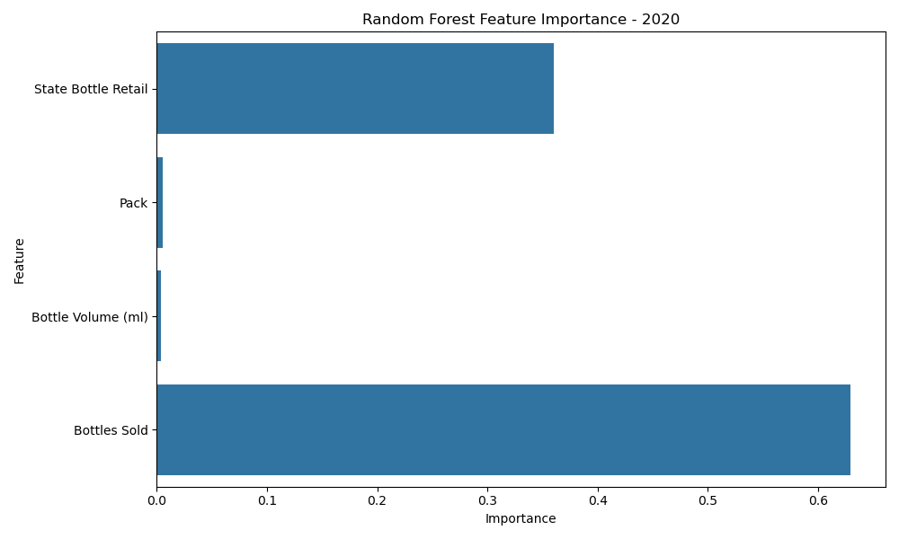

# Analysis of Iowa State Liquor Sales Data (Extremes, Distribution, and Correlation)

## Methodology

Our main dataset contains Iowa State Liquor sales data, including products, stores, and sales records. Initially, I needed to understand the data, so I briefly looked at the time span and descriptions of numerical data. Based on this, I identified several interesting angles for analysis. Around these angles, from macro to micro, from shallow to deep, I designed four parts of research.

The first part of the analysis focuses on popularity, where I selected stores, products, cities, and sales volume as analysis objects. In this part, I used basic statistical methods such as sorting, grouping, and aggregation.

The second part studies the distribution of liquor pricing. I wanted to test whether the cost and retail price of liquor follow a normal distribution. I wanted to know if most liquor prices fall within a certain range and if there are any particularly high or low-priced liquors. Additionally, I wanted to study the distribution of liquor volume (ml/bottle) and Pack sizes to understand what bottle sizes people buy most often and what Pack sizes they prefer.

In the third part, focusing on specific liquors (ranked 1-3 and 8-10 in sales) and specific Pack Sizes (6, 12, 48), I studied their sales relationship with time. I selected 2013, 2017, and 2021 as observation periods (these were random, with no special significance). I wanted to see how sales of these liquors changed over different time periods, whether they became more or less popular over time. I also wanted to know their monthly sales distribution to see if these liquors/Pack Sizes were particularly popular in certain months.

Furthermore, for the top ten selling liquors, I studied their sales distribution in popular cities (six cities ranking in the top ten in sales). I wanted to see if these liquors were particularly popular in certain cities.

The fourth part analyzes the correlation between liquor sales and unit price, volume, and Pack Size, as well as comparing the importance of unit price, volume, and Pack Size to sales.

Most analyses were completed using Spark's DataFrame API because the large data volume benefits from Spark's distributed computing capabilities. For visualization, I used matplotlib to create charts and pandas to process data. For feature importance analysis, I used Spark's MLlib library with the Random Forest algorithm. During this process, I also tried the Lasso method but found it less effective, so I ultimately stuck with Random Forest.

## Problems

### Spark Operation Issues

- Memory management: Memory was often insufficient during Spark operations. To solve this, I tried various methods, including configuring appropriate memory parameters, increasing JVM heap memory, optimizing data processing flow, and reducing data volume.
- Version issues: Incompatibility between Spark and pyspark versions led to some functions being unusable, later switched to Pandas for data processing.
- Spark sessions not properly closed, leading to resource release issues, later wrote finally blocks to ensure resource release.
- DataFrame type confusion: During data processing, I often needed to convert DataFrames to other types, such as Pandas DataFrame or RDD, but sometimes overlooked this, leading to type confusion. Later resolved through documentation review and testing.

### Analysis and Visualization Issues

- When creating histograms, data needed scaling due to large absolute value differences to prevent chart disproportion.
- Sometimes charts were cluttered with poor readability: To improve aesthetics, better color schemes were adopted for clarity, and the number of displayed digits was controlled by removing less important numbers.
- Feature importance analysis method selection: Initially chose Lasso method but found it less effective, ultimately used Random Forest algorithm.
- Correlation analysis and feature selection: Initially selected all features but found computation too intensive, so selected only important features. The process of selecting important features had some detours, initially unclear which features were important, took several iterations to finalize analysis variables.

## Results

### Popularity Analysis

    

From the graphs, we can see:

- DIAGEO AMERICAS and SAZERAC COMPANY INC. are the highest-volume suppliers, each exceeding 30 million bottles. Other suppliers like JIM BEAM BRANDS and HEAVEN HILL BRANDS also performed well.
- FIREBALL CINNAMON WHISKEY and BLACK VELVET are the most popular products, each exceeding 10 million bottles. Other popular products include HAWKEYE VODKA and TITOS HANDMADE VODKA.
- HY-VEE #3 / BDI / DES MOINES and CENTRAL CITY 2 are the highest-volume stores, each exceeding 6 million bottles. Other stores like HY-VEE WINE AND SPIRITS / IOWA CITY also show high sales volumes.
- DES MOINES is the highest-volume city, exceeding 30 million bottles. Other cities like CEDAR RAPIDS and DAVENPORT also show high sales volumes.

### Continuous Variables (Cost, Retail Price)/Discrete Variables (Pack, Bottle Volume) Distribution Analysis

    

From the graphs, we can see:

- Liquor cost and retail price don't perfectly follow normal distribution, showing right-skewed distribution, with retail price distribution being broader and more dispersed. The cost distribution peaks at $7.3, while retail price distribution peaks at $11.
- Liquor volume and Pack Size distributions are relatively dispersed, with 750ml being the most sold volume and 12-bottle being the most popular Pack Size.
- Most liquor volumes are below 1000ml, and Pack Sizes are mostly below 12 bottles. However, 48-bottle packs show higher sales than 24-bottle packs, possibly due to better transport and storage efficiency, and price advantages.

### Detailed Analysis

  
  
  

From the graphs, we can see:

- *Hot-selling Liquor Sales Trend Analysis*: People's preferences for liquor are not constant. For example, FIREBALL CINNAMON WHISKEY and HAWKEYE VODKA both showed strong performance in 2013 and 2017, dominating the top two positions in the market. However, by 2021, FIREBALL CINNAMON WHISKEY became the most popular liquor, while both BLACK VELVET and HAWKEYE VODKA experienced significant declines in sales.
- *Different Pack Size Sales Trends*: 12-bottle packs are most popular, maintaining leadership across all years. 6-bottle and 48-bottle packs rank second and third. From 2013 to 2021, major Pack Sizes showed upward sales trends. 48-bottle pack sales significantly exceed 24-bottle packs, possibly due to wholesale discounts and transport efficiency.
- *City Sales Distribution*: Different liquors show varying popularity across cities, reflecting regional consumption preferences.

### Correlation and Feature Importance Analysis

  
  
  

Based on correlation heatmaps from 2018, 2020, and 2022:

- Main Factors Affecting Sales (Bottles Sold): Sales Dollar is the primary factor, logically as sales volume strongly correlates with sales amount. Pack Size ranks second, as larger Pack Size means more bottles per pack sale. State Bottle Retail ranks third and fourth, showing order volume doesn't strongly correlate with single bottle retail price, and higher unit prices lead to lower sales volume. Larger bottle volumes also correlate with lower sales.
- Pack Size Impact: Pack negatively correlates with Bottle Volume, coefficient around -0.5, larger Pack Size means smaller bottle volume. Pack Size also negatively correlates with State Bottle Retail, indicating larger Pack Size means more discounts. However, increased Pack Size helps increase Bottles Sold.
- Time Trend Changes: From 2018 to 2022, correlations between main variables remained relatively stable, with small coefficient changes, indicating mature market pricing mechanisms and sales models.

  
  
  

For feature importance analysis, studying Sales Dollar against State Bottle Retail, Pack, Bottle Volume, and Bottles Sold features across 2018, 2020, and 2022:

- Throughout these periods, Bottles Sold and State Bottle Retail show highest importance, while Pack and Bottle Volume show lowest, indicating State Bottle Retail most significantly impacts Sales Dollar.
- However, in 2020, Pack importance among lower-importance features suddenly increased, while State Bottle Retail importance among higher-importance features also notably increased, suggesting people preferred larger Pack Sizes and lower unit prices in 2020, becoming more value-conscious during COVID-19's economic impact. 2022 data resembles 2018, indicating post-pandemic consumption patterns returned to normal.
