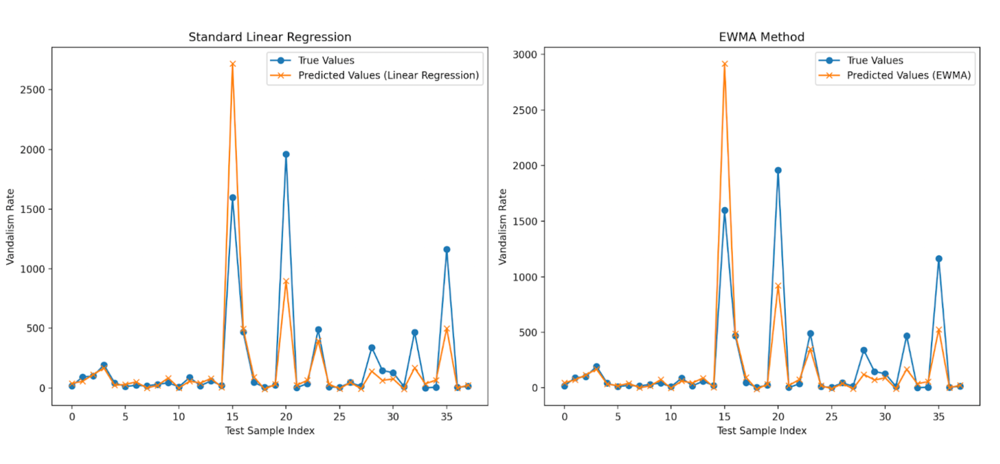

# How to Run this program:

### 1 Prepare the Data:
Place part-0.csv in the same directory as vandalism.py. Here is the download link for the file, part-0.csv, which is a snippet of the original data: https://docs.google.com/spreadsheets/d/1gOMUd-8OSWYGjJVDuIcWg3oxJgb6XuKcY5jLHffCSP0/edit?usp=share_link

### 2 Install Dependencies:
Make sure Python 3.x is installed.
Install the required libraries: pip install pandas numpy scikit-learn

### 3 Run the Script:
In the terminal, navigate to the directory containing vandalism.py and part-0.csv.
Run the script: python3 vandalism.py

# Vandalism Prediction Details
## Objective
The objective was to predict vandalism rates across counties by alcohol consumption, since it is widely believed that alcohol is one of the most important causes of some misbehaviors. We are using two methods:
* **Standard Linear Regression:** Utilized total alcohol sales data (order count and total gallons sold) as features.
* **Exponentially Weighted Moving Average (EWMA):** Emphasized recent trends in alcohol sales using a weighted average.

## Methodology
### 1. Data Splitting:
* The first 60 counties (sorted alphabetically) were used as the training set.
* The remaining counties were used as the testing set.
### 2. Feature Engineering:
* For the standard method: Total orders and total gallons sold were directly used as features.
* For the EWMA method: Features were calculated using a span of 3 for EWMA to emphasize recent sales data trends.
### 3. Evaluation:
* Both models were trained using the training set.
* The test set was used to evaluate performance using the mean squared error (MSE) as the loss function.
* Weights (w1,w2) and intercept (b) were extracted for interpretability.

## Observations:
### 1. Weights (w1,w2):
* In the standard method, both weights are small, indicating weak relationships between features and vandalism rates.
* In the EWMA method, the weights are larger, showing a stronger dependence on the recent trends in alcohol sales.
### 2. Intercept (b):
* Both methods yield similar intercepts (~-21.6), implying similar baseline predictions when features are zero.
### 3. Loss:
* The standard linear regression outperformed the EWMA method on the test set, with a lower loss (78,850 vs. 89,769).
* This suggests that long-term trends may better capture the relationships between alcohol sales and vandalism rates compared to recent trends.

.  
.   

## Conclusion:
The standard linear regression method provided better predictions with lower loss. The EWMA method emphasized recent data but failed to outperform the standard approach. This indicates that historical data trends may be more influential in predicting vandalism rates.
